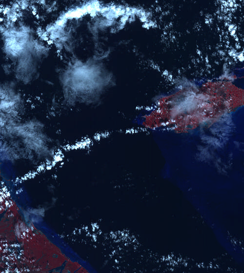
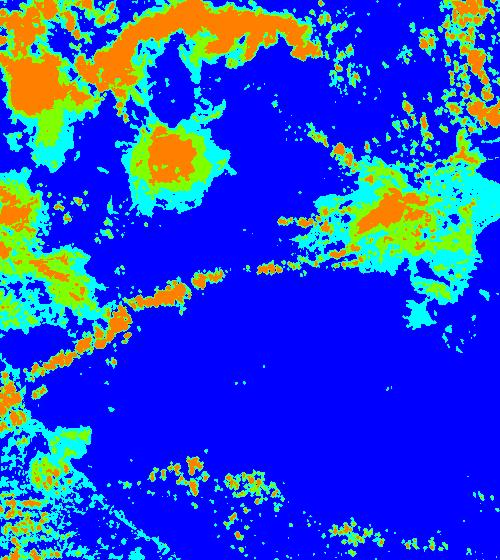

# Satellite image direct interpretation

 | 
:-------------------:|:--------------------:
_Original_ | _Result_

## Build

```
$ pwd
.../cloud_detection
$ cargo build --release
```

## Usage

```
$ cargo run --release [directory]
```

If no repository is specified the default path will be the current path `./`.

```
$ pwd
.../IMAGES
$ ls
image1.bmp image2.bmp ... imageN.bmp
$ cargo run --release
```

## Automated tests

The automated tests program displays the data i nthe following format:

```
X.bmp | Cloud coverage: X% | Iterations: X | Elapsed time: X ms
```

- **X.bmp**: filename.
- **Cloud coverage**: Pixel ration which belongs in the last class.
- **Iterations**: K-means algorithm iteration count.
- **Elapsed time**: time elapsed for one image processing.
